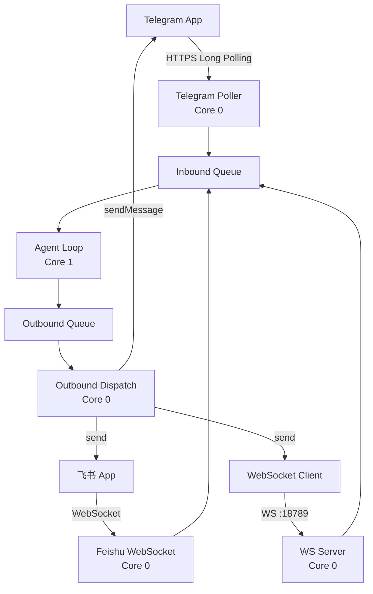
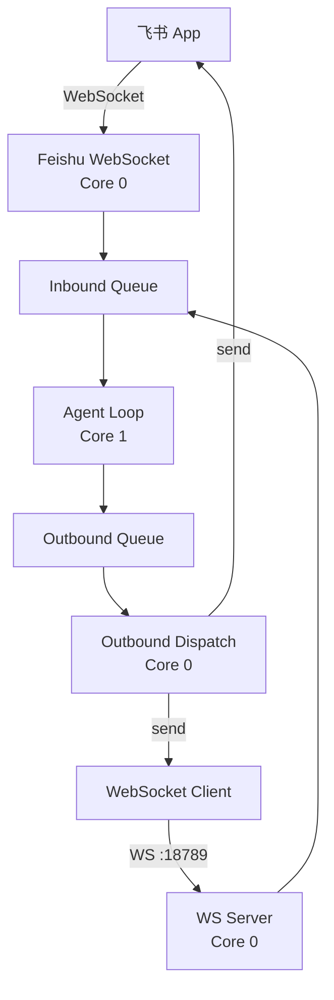

# 设计文档：移除 Telegram 通道

## 概述

本设计文档描述了如何从 MimiClaw ESP32-S3 AI 代理系统中完全移除 Telegram 通道支持，简化系统架构，仅保留飞书（Feishu）作为唯一的即时通讯通道。

移除范围：
- Telegram 轮询任务和相关代码
- Telegram 消息发送逻辑  
- Telegram 配置项和 NVS 存储
- 构建系统中的 Telegram 源文件引用

保留内容：
- 飞书通道的完整功能（WebSocket 长连接）
- WebSocket 网关（端口 18789）
- 消息总线机制
- 所有其他核心功能（Agent Loop、LLM Proxy、工具系统等）

## 主要算法/工作流

### 系统架构变更（移除前 vs 移除后）

**移除前的架构：**



**移除后的架构：**




### 数据流变更

**移除前的消息流：**
1. 用户通过 Telegram/飞书/WebSocket 发送消息
2. 对应的通道轮询器接收消息，封装为 mimi_msg_t
3. 消息推送到 Inbound Queue
4. Agent Loop 处理消息并生成响应
5. 响应推送到 Outbound Queue
6. Outbound Dispatch 根据 channel 字段路由到对应通道

**移除后的消息流：**
1. 用户通过飞书/WebSocket 发送消息
2. 对应的通道接收消息，封装为 mimi_msg_t
3. 消息推送到 Inbound Queue
4. Agent Loop 处理消息并生成响应
5. 响应推送到 Outbound Queue
6. Outbound Dispatch 根据 channel 字段路由（仅支持 feishu/websocket）

## 核心接口/类型

### 消息总线类型（保持不变）

```c
/* 通道标识符 - 移除 MIMI_CHAN_TELEGRAM */
#define MIMI_CHAN_FEISHU     "feishu"
#define MIMI_CHAN_WEBSOCKET  "websocket"
#define MIMI_CHAN_CLI        "cli"
#define MIMI_CHAN_SYSTEM     "system"

/* 消息类型（保持不变） */
typedef struct {
    char channel[16];       /* "feishu", "websocket", "cli" */
    char chat_id[96];       /* 飞书 chat_id/open_id 或 WS 客户端 id */
    char *content;          /* 堆分配的消息文本 */
} mimi_msg_t;
```


### 配置项变更

**移除的配置项（mimi_config.h）：**

```c
/* 移除这些 Telegram 相关的配置 */
// #define MIMI_SECRET_TG_TOKEN        ""
// #define MIMI_TG_POLL_TIMEOUT_S       30
// #define MIMI_TG_MAX_MSG_LEN          4096
// #define MIMI_TG_POLL_STACK           (12 * 1024)
// #define MIMI_TG_POLL_PRIO            5
// #define MIMI_TG_POLL_CORE            0
// #define MIMI_TG_CARD_SHOW_MS         3000
// #define MIMI_TG_CARD_BODY_SCALE      3
```

**移除的 NVS 命名空间：**

```c
/* 移除 Telegram NVS 配置 */
// #define MIMI_NVS_TG                  "tg_config"
// #define MIMI_NVS_KEY_TG_TOKEN        "bot_token"
```

## 关键函数与形式化规范

### 函数 1: outbound_dispatch_task()

**修改前的函数签名：**

```c
static void outbound_dispatch_task(void *arg)
```

**前置条件：**
- 消息总线已初始化
- Telegram、飞书、WebSocket 通道已启动
- Outbound Queue 可用

**后置条件：**
- 从 Outbound Queue 读取消息
- 根据 channel 字段路由到 telegram/feishu/websocket
- 释放消息内容内存


**修改后的函数签名：**

```c
static void outbound_dispatch_task(void *arg)
```

**前置条件：**
- 消息总线已初始化
- 飞书、WebSocket 通道已启动
- Outbound Queue 可用

**后置条件：**
- 从 Outbound Queue 读取消息
- 根据 channel 字段路由到 feishu/websocket（移除 telegram 分支）
- 释放消息内容内存

**循环不变式：**
- 队列中的所有消息最终都会被处理
- 每条消息的 content 指针在处理后被正确释放

### 函数 2: app_main()

**修改前的初始化序列：**

```c
ESP_ERROR_CHECK(telegram_bot_init());
// ... 其他初始化
ESP_ERROR_CHECK(telegram_bot_start());
```

**前置条件：**
- NVS 已初始化
- WiFi 已连接
- 消息总线已创建

**后置条件：**
- Telegram 轮询任务已启动
- Telegram bot token 已加载


**修改后的初始化序列：**

```c
// 移除 telegram_bot_init() 和 telegram_bot_start() 调用
ESP_ERROR_CHECK(feishu_bot_init());
// ... 其他初始化
ESP_ERROR_CHECK(feishu_bot_start());
```

**前置条件：**
- NVS 已初始化
- WiFi 已连接
- 消息总线已创建

**后置条件：**
- 仅飞书 WebSocket 任务已启动
- 飞书凭证已加载

**循环不变式：** N/A（初始化函数，非循环）

## 算法伪代码

### 主处理算法：outbound_dispatch_task（修改后）

```pascal
ALGORITHM outbound_dispatch_task(arg)
INPUT: arg（任务参数，未使用）
OUTPUT: 无（无限循环任务）

BEGIN
  WHILE true DO
    // 从出站队列读取消息（阻塞等待）
    msg ← message_bus_pop_outbound(UINT32_MAX)
    
    IF msg = NULL THEN
      CONTINUE
    END IF
    
    // 记录日志
    LOG("分发响应到", msg.channel, ":", msg.chat_id)
    
    // 根据通道类型分发（移除 Telegram 分支）
    IF msg.channel = "feishu" THEN
      send_err ← feishu_send_message(msg.chat_id, msg.content)
      IF send_err ≠ ESP_OK THEN
        LOG_ERROR("飞书发送失败:", msg.chat_id)
      ELSE
        LOG_INFO("飞书发送成功:", msg.chat_id)
      END IF
      
    ELSE IF msg.channel = "websocket" THEN
      ws_err ← ws_server_send(msg.chat_id, msg.content)
      IF ws_err ≠ ESP_OK THEN
        LOG_WARN("WebSocket 发送失败:", msg.chat_id)
      END IF
      
    ELSE IF msg.channel = "system" THEN
      LOG_INFO("系统消息:", msg.chat_id, msg.content)
      
    ELSE
      LOG_WARN("未知通道:", msg.channel)
    END IF
    
    // 释放消息内容内存
    free(msg.content)
  END WHILE
END
```


**前置条件：**
- message_bus_pop_outbound 函数可用
- feishu_send_message 和 ws_server_send 函数已初始化
- 消息队列已创建

**后置条件：**
- 所有出站消息都被正确路由到对应通道
- 消息内容内存被正确释放
- 不支持的通道会记录警告日志

**循环不变式：**
- 队列中的每条消息都会被处理一次且仅一次
- 每条消息的 content 指针在处理后被释放

### 初始化算法：app_main（修改后）

```pascal
ALGORITHM app_main()
INPUT: 无
OUTPUT: 无（系统启动）

BEGIN
  // 阶段 1：核心基础设施初始化
  init_nvs()
  esp_event_loop_create_default()
  init_spiffs()
  
  // 阶段 2：子系统初始化
  message_bus_init()
  memory_store_init()
  skill_loader_init()
  session_mgr_init()
  wifi_manager_init()
  http_proxy_init()
  
  // 移除：telegram_bot_init()
  feishu_bot_init()
  
  llm_proxy_init()
  tool_registry_init()
  cron_service_init()
  heartbeat_init()
  agent_loop_init()
  
  // 阶段 3：启动串口 CLI（无需 WiFi）
  serial_cli_init()
  
  // 阶段 4：启动 WiFi
  wifi_err ← wifi_manager_start()
  wifi_ok ← false
  
  IF wifi_err = ESP_OK THEN
    wifi_manager_scan_and_print()
    IF wifi_manager_wait_connected(30000) = ESP_OK THEN
      wifi_ok ← true
      LOG_INFO("WiFi 已连接")
    ELSE
      LOG_WARN("WiFi 连接超时")
    END IF
  ELSE
    LOG_WARN("未配置 WiFi 凭证")
  END IF
  
  // 阶段 5：WiFi 入网（如果连接失败）
  IF NOT wifi_ok THEN
    LOG_WARN("进入 WiFi 配网模式")
    wifi_onboard_start(WIFI_ONBOARD_MODE_CAPTIVE)
    RETURN  // 不可达（配网成功后会重启）
  END IF
  
  // 启动管理员配置热点
  wifi_onboard_start(WIFI_ONBOARD_MODE_ADMIN)
  
  // 阶段 6：启动网络相关服务
  xTaskCreatePinnedToCore(outbound_dispatch_task, ...)
  
  agent_loop_start()
  
  // 移除：telegram_bot_start()
  feishu_bot_start()
  
  cron_service_start()
  heartbeat_start()
  ws_server_start()
  
  LOG_INFO("所有服务已启动")
END
```


**前置条件：**
- ESP32-S3 硬件已上电
- Flash 分区已正确配置
- SPIFFS 分区可用

**后置条件：**
- 所有核心服务已初始化并启动
- 飞书 WebSocket 连接已建立（如果配置了凭证）
- WebSocket 网关正在监听端口 18789
- Agent Loop 正在处理消息
- Telegram 相关服务未启动

**循环不变式：** N/A（初始化函数，非循环）

## 示例用法

### 示例 1：飞书消息处理流程

```c
// 1. 飞书 WebSocket 接收到消息
// feishu_bot.c: handle_message_event()
mimi_msg_t msg = {0};
strncpy(msg.channel, MIMI_CHAN_FEISHU, sizeof(msg.channel) - 1);
strncpy(msg.chat_id, route_id, sizeof(msg.chat_id) - 1);
msg.content = strdup(cleaned_text);

// 2. 推送到入站队列
message_bus_push_inbound(&msg);

// 3. Agent Loop 处理消息并生成响应
// agent_loop.c 处理后推送到出站队列
mimi_msg_t response = {0};
strncpy(response.channel, MIMI_CHAN_FEISHU, sizeof(response.channel) - 1);
strncpy(response.chat_id, chat_id, sizeof(response.chat_id) - 1);
response.content = strdup(llm_response);
message_bus_push_outbound(&response);

// 4. Outbound Dispatch 路由到飞书
// mimi.c: outbound_dispatch_task()
if (strcmp(msg.channel, MIMI_CHAN_FEISHU) == 0) {
    feishu_send_message(msg.chat_id, msg.content);
}
```


### 示例 2：WebSocket 消息处理流程

```c
// 1. WebSocket 客户端发送消息
// ws_server.c 接收并推送到入站队列
mimi_msg_t msg = {0};
strncpy(msg.channel, MIMI_CHAN_WEBSOCKET, sizeof(msg.channel) - 1);
strncpy(msg.chat_id, client_id, sizeof(msg.chat_id) - 1);
msg.content = strdup(message_text);
message_bus_push_inbound(&msg);

// 2. Agent Loop 处理后推送响应
mimi_msg_t response = {0};
strncpy(response.channel, MIMI_CHAN_WEBSOCKET, sizeof(response.channel) - 1);
strncpy(response.chat_id, client_id, sizeof(response.chat_id) - 1);
response.content = strdup(llm_response);
message_bus_push_outbound(&response);

// 3. Outbound Dispatch 路由到 WebSocket
// mimi.c: outbound_dispatch_task()
if (strcmp(msg.channel, MIMI_CHAN_WEBSOCKET) == 0) {
    ws_server_send(msg.chat_id, msg.content);
}
```

### 示例 3：错误处理（未知通道）

```c
// Outbound Dispatch 收到未知通道的消息
mimi_msg_t msg;
message_bus_pop_outbound(&msg, UINT32_MAX);

if (strcmp(msg.channel, "telegram") == 0) {
    // Telegram 已移除，记录警告
    ESP_LOGW(TAG, "Unknown channel: telegram (已移除)");
} else if (strcmp(msg.channel, "unknown_channel") == 0) {
    ESP_LOGW(TAG, "Unknown channel: unknown_channel");
}

// 无论如何都要释放内存
free(msg.content);
```

## 正确性属性

### 属性 1：消息路由完整性

**通用量化陈述：**
```
∀ msg ∈ OutboundQueue:
  (msg.channel = "feishu" ⟹ feishu_send_message(msg.chat_id, msg.content) 被调用) ∧
  (msg.channel = "websocket" ⟹ ws_server_send(msg.chat_id, msg.content) 被调用) ∧
  (msg.channel ∉ {"feishu", "websocket", "cli", "system"} ⟹ 记录警告日志)
```

**测试方法：**
- 单元测试：模拟不同 channel 值的消息，验证路由逻辑
- 集成测试：发送飞书和 WebSocket 消息，验证端到端流程


### 属性 2：内存安全性

**通用量化陈述：**
```
∀ msg ∈ OutboundQueue:
  msg.content ≠ NULL ⟹ free(msg.content) 在处理后被调用一次且仅一次
```

**测试方法：**
- 内存泄漏检测：使用 ESP-IDF heap tracing 工具
- 静态分析：检查所有代码路径都正确释放内存

### 属性 3：Telegram 代码完全移除

**通用量化陈述：**
```
∀ file ∈ SourceFiles:
  ¬∃ reference: reference 指向 telegram_bot.c 或 telegram_bot.h ∧
  ¬∃ symbol: symbol ∈ {"telegram_bot_init", "telegram_bot_start", "telegram_send_message"} ∧
  ¬∃ constant: constant ∈ {"MIMI_CHAN_TELEGRAM", "MIMI_TG_*", "MIMI_NVS_TG"}
```

**测试方法：**
- 编译测试：确保编译成功且无未定义符号
- 代码搜索：grep 搜索 "telegram" 关键字，确认无残留引用

### 属性 4：系统功能保持不变

**通用量化陈述：**
```
∀ feature ∈ {飞书消息, WebSocket消息, Agent处理, LLM调用, 工具执行}:
  feature 在移除 Telegram 后功能保持不变
```

**测试方法：**
- 回归测试：运行现有的飞书和 WebSocket 测试用例
- 手动测试：验证端到端消息流程

## 错误处理

### 错误场景 1：收到 Telegram 通道消息

**条件：** Outbound Queue 中出现 channel = "telegram" 的消息

**响应：** 
- 记录警告日志："Unknown channel: telegram"
- 不尝试发送消息
- 正确释放消息内容内存

**恢复：** 
- 系统继续正常运行
- 其他通道的消息不受影响


### 错误场景 2：编译时缺少 Telegram 符号

**条件：** 代码中仍有对 Telegram 函数的引用

**响应：** 
- 编译器报错：undefined reference to 'telegram_bot_init'
- 构建失败

**恢复：** 
- 检查并移除所有 Telegram 相关的函数调用
- 重新编译

### 错误场景 3：NVS 中存在旧的 Telegram 配置

**条件：** 设备之前配置过 Telegram token，NVS 中仍有数据

**响应：** 
- 系统忽略 NVS 中的 Telegram 配置
- 不尝试读取或使用 Telegram token

**恢复：** 
- 可选：使用 CLI 命令清除 NVS 中的 Telegram 命名空间
- 系统正常运行，不受影响

## 测试策略

### 单元测试方法

**测试目标：**
- 验证 outbound_dispatch_task 正确路由消息
- 验证 Telegram 分支已完全移除
- 验证内存正确释放

**测试用例：**

1. **测试飞书消息路由**
   - 输入：channel = "feishu", chat_id = "ou_xxx", content = "测试消息"
   - 预期：feishu_send_message 被调用，返回 ESP_OK
   - 验证：content 内存被释放

2. **测试 WebSocket 消息路由**
   - 输入：channel = "websocket", chat_id = "ws_123", content = "测试消息"
   - 预期：ws_server_send 被调用
   - 验证：content 内存被释放

3. **测试未知通道处理**
   - 输入：channel = "telegram", chat_id = "12345", content = "测试消息"
   - 预期：记录警告日志，不调用任何发送函数
   - 验证：content 内存被释放

4. **测试系统消息处理**
   - 输入：channel = "system", chat_id = "info", content = "系统消息"
   - 预期：记录信息日志
   - 验证：content 内存被释放


### 属性测试方法

**属性测试库：** 手动测试（ESP32 平台暂无成熟的属性测试框架）

**测试属性：**

1. **消息路由幂等性**
   - 属性：相同的消息多次处理应产生相同的路由结果
   - 测试方法：发送相同的消息 100 次，验证路由行为一致

2. **内存释放完整性**
   - 属性：所有分配的消息内容内存都应被释放
   - 测试方法：使用 ESP-IDF heap tracing，验证无内存泄漏

3. **通道隔离性**
   - 属性：一个通道的错误不应影响其他通道
   - 测试方法：模拟飞书发送失败，验证 WebSocket 仍正常工作

### 集成测试方法

**测试场景：**

1. **端到端飞书消息流**
   - 步骤：
     1. 通过飞书发送消息 "你好"
     2. 验证消息到达 Inbound Queue
     3. 验证 Agent Loop 处理消息
     4. 验证响应通过飞书返回
   - 预期：完整的消息往返成功

2. **端到端 WebSocket 消息流**
   - 步骤：
     1. WebSocket 客户端连接到端口 18789
     2. 发送 JSON 消息 {"type": "message", "content": "测试"}
     3. 验证响应返回
   - 预期：WebSocket 通信正常

3. **多通道并发测试**
   - 步骤：
     1. 同时从飞书和 WebSocket 发送消息
     2. 验证两个通道的响应都正确返回
   - 预期：无消息丢失，无通道干扰


## 性能考虑

### 内存占用优化

**移除前的内存占用：**
- Telegram 轮询任务栈：12 KB
- Telegram HTTP 缓冲区：~8 KB
- Telegram TLS 连接：~60 KB
- 总计：~80 KB

**移除后的内存节省：**
- 节省任务栈：12 KB
- 节省 HTTP 缓冲区：8 KB
- 节省 TLS 连接：60 KB
- 总计节省：~80 KB

**优化效果：**
- 可用 PSRAM 增加约 80 KB
- 可用于更大的 LLM 上下文缓冲区或更多并发会话

### CPU 占用优化

**移除前的 CPU 占用：**
- Telegram 长轮询（30 秒超时）：Core 0，优先级 5
- 轮询间隔：连续轮询，无空闲

**移除后的 CPU 优化：**
- Core 0 减少一个高优先级任务
- 减少 HTTP 请求处理开销
- 减少 JSON 解析开销

**优化效果：**
- Core 0 负载降低约 10-15%
- 更多 CPU 时间用于 WebSocket 和飞书处理

### 网络带宽优化

**移除前的网络占用：**
- Telegram 长轮询：持续 HTTPS 连接
- 平均带宽：~1-2 KB/s（空闲时）

**移除后的网络优化：**
- 减少一个持续的 HTTPS 连接
- 飞书使用 WebSocket（更高效）

**优化效果：**
- 网络连接数减少 1 个
- 空闲时网络流量减少


## 安全考虑

### 凭证管理

**移除前：**
- Telegram Bot Token 存储在 NVS 和 mimi_secrets.h
- 需要管理两套 IM 凭证

**移除后：**
- 仅需管理飞书 App ID 和 App Secret
- 简化凭证管理流程

**安全改进：**
- 减少凭证泄露的攻击面
- 减少需要保护的敏感数据

### 网络安全

**移除前：**
- Telegram API：HTTPS（TLS 1.2+）
- 飞书 API：HTTPS + WebSocket（TLS）

**移除后：**
- 飞书 API：HTTPS + WebSocket（TLS）
- 减少一个外部 API 依赖

**安全改进：**
- 减少外部网络连接数
- 降低中间人攻击风险

### 代码审计

**移除前：**
- 需要审计 Telegram 和飞书两套代码
- 代码复杂度更高

**移除后：**
- 仅需审计飞书相关代码
- 代码复杂度降低

**安全改进：**
- 更容易发现和修复安全漏洞
- 减少潜在的安全隐患

## 依赖项

### 保留的依赖项

**ESP-IDF 组件：**
- nvs_flash：NVS 存储
- esp_wifi：WiFi 连接
- esp_netif：网络接口
- esp_http_client：HTTP 客户端（飞书 API）
- esp_http_server：HTTP 服务器（WebSocket）
- esp_websocket_client：WebSocket 客户端（飞书长连接）
- esp_https_ota：OTA 更新
- esp_event：事件循环
- json：cJSON 库
- spiffs：文件系统
- console：串口 CLI
- vfs：虚拟文件系统
- app_update：应用更新
- esp-tls：TLS 支持
- esp_timer：定时器
- led_strip：LED 控制


**驱动组件：**
- esp_driver_gpio：GPIO 控制
- esp_driver_ledc：PWM 控制
- esp_driver_rmt：RMT 控制（LED）

### 移除的依赖项

无。所有依赖项都被飞书或其他功能使用，无需移除。

### 外部 API 依赖

**移除前：**
- Telegram Bot API (api.telegram.org)
- 飞书开放平台 API (open.feishu.cn)
- Anthropic Claude API (api.anthropic.com)
- Brave Search API（可选）

**移除后：**
- 飞书开放平台 API (open.feishu.cn)
- Anthropic Claude API (api.anthropic.com)
- Brave Search API（可选）

## 实施细节

### 需要修改的文件清单

**1. main/mimi.c**
- 移除 `#include "channels/telegram/telegram_bot.h"`
- 移除 `telegram_bot_init()` 调用
- 移除 `telegram_bot_start()` 调用
- 修改 `outbound_dispatch_task()`，移除 Telegram 分支

**2. main/mimi_config.h**
- 移除所有 `MIMI_SECRET_TG_*` 宏定义
- 移除所有 `MIMI_TG_*` 配置宏
- 移除 `MIMI_NVS_TG` 和 `MIMI_NVS_KEY_TG_TOKEN` 宏

**3. main/CMakeLists.txt**
- 从 SRCS 列表中移除 `"channels/telegram/telegram_bot.c"`

**4. main/bus/message_bus.h**
- 移除 `#define MIMI_CHAN_TELEGRAM "telegram"`

**5. docs/ARCHITECTURE.md**
- 更新系统架构图，移除 Telegram 组件
- 更新数据流说明
- 更新模块映射表


### 需要删除的文件清单

**1. main/channels/telegram/telegram_bot.c**
- 完整删除文件

**2. main/channels/telegram/telegram_bot.h**
- 完整删除文件

**3. main/channels/telegram/ 目录**
- 删除整个目录（如果为空）

### 代码修改详细位置

#### 文件：main/mimi.c

**位置 1：头文件引用（第 14 行）**

```c
// 移除前
#include "channels/telegram/telegram_bot.h"
#include "channels/feishu/feishu_bot.h"

// 移除后
#include "channels/feishu/feishu_bot.h"
```

**位置 2：初始化序列（第 120 行左右）**

```c
// 移除前
ESP_ERROR_CHECK(http_proxy_init());
ESP_ERROR_CHECK(telegram_bot_init());
ESP_ERROR_CHECK(feishu_bot_init());
ESP_ERROR_CHECK(llm_proxy_init());

// 移除后
ESP_ERROR_CHECK(http_proxy_init());
ESP_ERROR_CHECK(feishu_bot_init());
ESP_ERROR_CHECK(llm_proxy_init());
```

**位置 3：服务启动序列（第 180 行左右）**

```c
// 移除前
ESP_ERROR_CHECK(agent_loop_start());
ESP_ERROR_CHECK(telegram_bot_start());
ESP_ERROR_CHECK(feishu_bot_start());
cron_service_start();

// 移除后
ESP_ERROR_CHECK(agent_loop_start());
ESP_ERROR_CHECK(feishu_bot_start());
cron_service_start();
```


**位置 4：outbound_dispatch_task 函数（第 70-100 行）**

```c
// 移除前
static void outbound_dispatch_task(void *arg)
{
    ESP_LOGI(TAG, "Outbound dispatch started");

    while (1) {
        mimi_msg_t msg;
        if (message_bus_pop_outbound(&msg, UINT32_MAX) != ESP_OK) continue;

        ESP_LOGI(TAG, "Dispatching response to %s:%s", msg.channel, msg.chat_id);

        if (strcmp(msg.channel, MIMI_CHAN_TELEGRAM) == 0) {
            esp_err_t send_err = telegram_send_message(msg.chat_id, msg.content);
            if (send_err != ESP_OK) {
                ESP_LOGE(TAG, "Telegram send failed for %s: %s", msg.chat_id, esp_err_to_name(send_err));
            } else {
                ESP_LOGI(TAG, "Telegram send success for %s (%d bytes)", msg.chat_id, (int)strlen(msg.content));
            }
        } else if (strcmp(msg.channel, MIMI_CHAN_FEISHU) == 0) {
            // ... 飞书处理
        } else if (strcmp(msg.channel, MIMI_CHAN_WEBSOCKET) == 0) {
            // ... WebSocket 处理
        } else if (strcmp(msg.channel, MIMI_CHAN_SYSTEM) == 0) {
            // ... 系统消息处理
        } else {
            ESP_LOGW(TAG, "Unknown channel: %s", msg.channel);
        }

        free(msg.content);
    }
}

// 移除后
static void outbound_dispatch_task(void *arg)
{
    ESP_LOGI(TAG, "Outbound dispatch started");

    while (1) {
        mimi_msg_t msg;
        if (message_bus_pop_outbound(&msg, UINT32_MAX) != ESP_OK) continue;

        ESP_LOGI(TAG, "Dispatching response to %s:%s", msg.channel, msg.chat_id);

        if (strcmp(msg.channel, MIMI_CHAN_FEISHU) == 0) {
            esp_err_t send_err = feishu_send_message(msg.chat_id, msg.content);
            if (send_err != ESP_OK) {
                ESP_LOGE(TAG, "Feishu send failed for %s: %s", msg.chat_id, esp_err_to_name(send_err));
            } else {
                ESP_LOGI(TAG, "Feishu send success for %s (%d bytes)", msg.chat_id, (int)strlen(msg.content));
            }
        } else if (strcmp(msg.channel, MIMI_CHAN_WEBSOCKET) == 0) {
            esp_err_t ws_err = ws_server_send(msg.chat_id, msg.content);
            if (ws_err != ESP_OK) {
                ESP_LOGW(TAG, "WS send failed for %s: %s", msg.chat_id, esp_err_to_name(ws_err));
            }
        } else if (strcmp(msg.channel, MIMI_CHAN_SYSTEM) == 0) {
            ESP_LOGI(TAG, "System message [%s]: %.128s", msg.chat_id, msg.content);
        } else {
            ESP_LOGW(TAG, "Unknown channel: %s", msg.channel);
        }

        free(msg.content);
    }
}
```


#### 文件：main/mimi_config.h

**位置 1：构建时密钥定义（第 10-20 行）**

```c
// 移除前
#ifndef MIMI_SECRET_TG_TOKEN
#define MIMI_SECRET_TG_TOKEN        ""
#endif
#ifndef MIMI_SECRET_API_KEY
#define MIMI_SECRET_API_KEY         ""
#endif

// 移除后
#ifndef MIMI_SECRET_API_KEY
#define MIMI_SECRET_API_KEY         ""
#endif
```

**位置 2：Telegram 配置常量（第 50-60 行）**

```c
// 移除前
/* Telegram Bot */
#define MIMI_TG_POLL_TIMEOUT_S       30
#define MIMI_TG_MAX_MSG_LEN          4096
#define MIMI_TG_POLL_STACK           (12 * 1024)
#define MIMI_TG_POLL_PRIO            5
#define MIMI_TG_POLL_CORE            0
#define MIMI_TG_CARD_SHOW_MS         3000
#define MIMI_TG_CARD_BODY_SCALE      3

/* Feishu Bot */
#define MIMI_FEISHU_MAX_MSG_LEN      4096

// 移除后
/* Feishu Bot */
#define MIMI_FEISHU_MAX_MSG_LEN      4096
```

**位置 3：NVS 命名空间定义（第 150-160 行）**

```c
// 移除前
/* NVS Namespaces */
#define MIMI_NVS_WIFI                "wifi_config"
#define MIMI_NVS_TG                  "tg_config"
#define MIMI_NVS_FEISHU              "feishu_config"
#define MIMI_NVS_LLM                 "llm_config"

// 移除后
/* NVS Namespaces */
#define MIMI_NVS_WIFI                "wifi_config"
#define MIMI_NVS_FEISHU              "feishu_config"
#define MIMI_NVS_LLM                 "llm_config"
```

**位置 4：NVS 键定义（第 165-170 行）**

```c
// 移除前
/* NVS Keys */
#define MIMI_NVS_KEY_SSID            "ssid"
#define MIMI_NVS_KEY_PASS            "password"
#define MIMI_NVS_KEY_TG_TOKEN        "bot_token"
#define MIMI_NVS_KEY_FEISHU_APP_ID   "app_id"

// 移除后
/* NVS Keys */
#define MIMI_NVS_KEY_SSID            "ssid"
#define MIMI_NVS_KEY_PASS            "password"
#define MIMI_NVS_KEY_FEISHU_APP_ID   "app_id"
```


#### 文件：main/CMakeLists.txt

**位置：SRCS 列表（第 2-30 行）**

```cmake
# 移除前
idf_component_register(
    SRCS
        "mimi.c"
        "bus/message_bus.c"
        "wifi/wifi_manager.c"
        "channels/telegram/telegram_bot.c"
        "channels/feishu/feishu_bot.c"
        "llm/llm_proxy.c"
        # ... 其他源文件
    INCLUDE_DIRS
        "."
    REQUIRES
        nvs_flash esp_wifi esp_netif esp_http_client esp_http_server
        # ... 其他依赖
)

# 移除后
idf_component_register(
    SRCS
        "mimi.c"
        "bus/message_bus.c"
        "wifi/wifi_manager.c"
        "channels/feishu/feishu_bot.c"
        "llm/llm_proxy.c"
        # ... 其他源文件
    INCLUDE_DIRS
        "."
    REQUIRES
        nvs_flash esp_wifi esp_netif esp_http_client esp_http_server
        # ... 其他依赖
)
```

#### 文件：main/bus/message_bus.h

**位置：通道标识符定义（第 6-12 行）**

```c
// 移除前
/* Channel identifiers */
#define MIMI_CHAN_TELEGRAM   "telegram"
#define MIMI_CHAN_FEISHU     "feishu"
#define MIMI_CHAN_WEBSOCKET  "websocket"
#define MIMI_CHAN_CLI        "cli"
#define MIMI_CHAN_SYSTEM     "system"

// 移除后
/* Channel identifiers */
#define MIMI_CHAN_FEISHU     "feishu"
#define MIMI_CHAN_WEBSOCKET  "websocket"
#define MIMI_CHAN_CLI        "cli"
#define MIMI_CHAN_SYSTEM     "system"
```


### 可选的清理工作

#### 1. 清理 CLI 命令（如果存在）

如果 `main/cli/serial_cli.c` 中有 Telegram 相关的 CLI 命令（如 `set_tg_token`），也应该移除：

```c
// 搜索并移除类似以下的命令注册
static const esp_console_cmd_t tg_token_cmd = {
    .command = "set_tg_token",
    .help = "Set Telegram bot token",
    .func = &cmd_set_tg_token,
};
esp_console_cmd_register(&tg_token_cmd);
```

#### 2. 清理文档引用

**需要更新的文档文件：**
- `docs/ARCHITECTURE.md`：更新系统架构图和模块说明
- `README.md`：移除 Telegram 相关的设置说明
- `docs/im-integration/README.md`：移除 Telegram 集成文档

#### 3. 清理示例配置文件

**文件：main/mimi_secrets.h.example**

```c
// 移除前
#define MIMI_SECRET_TG_TOKEN        "your_telegram_bot_token_here"
#define MIMI_SECRET_FEISHU_APP_ID   "your_feishu_app_id_here"

// 移除后
#define MIMI_SECRET_FEISHU_APP_ID   "your_feishu_app_id_here"
```

### 验证步骤

#### 步骤 1：代码搜索验证

```bash
# 搜索所有 Telegram 相关的引用
grep -r "telegram" main/ --include="*.c" --include="*.h"
grep -r "MIMI_TG" main/ --include="*.c" --include="*.h"
grep -r "MIMI_CHAN_TELEGRAM" main/ --include="*.c" --include="*.h"

# 预期结果：无匹配项（或仅在注释中）
```

#### 步骤 2：编译验证

```bash
# 清理并重新编译
idf.py fullclean
idf.py build

# 预期结果：编译成功，无错误和警告
```


#### 步骤 3：符号检查验证

```bash
# 检查编译后的二进制文件中是否还有 Telegram 符号
xtensa-esp32s3-elf-nm build/mimiclaw.elf | grep -i telegram

# 预期结果：无匹配项
```

#### 步骤 4：运行时验证

```bash
# 烧录固件到设备
idf.py flash monitor

# 验证点：
# 1. 启动日志中无 "Telegram" 相关信息
# 2. 飞书消息正常收发
# 3. WebSocket 消息正常收发
# 4. 内存占用减少约 80 KB
```

#### 步骤 5：功能回归测试

**测试清单：**
- [ ] 飞书私聊消息收发正常
- [ ] 飞书群聊消息收发正常
- [ ] WebSocket 客户端连接正常
- [ ] WebSocket 消息收发正常
- [ ] Agent Loop 处理消息正常
- [ ] LLM API 调用正常
- [ ] 工具调用（web_search 等）正常
- [ ] 会话历史保存正常
- [ ] 内存管理正常（无泄漏）
- [ ] 系统稳定运行 24 小时以上

### 回滚计划

如果移除 Telegram 后出现问题，可以通过以下步骤回滚：

#### 回滚步骤 1：恢复代码

```bash
# 使用 Git 恢复到移除前的提交
git revert <commit_hash>

# 或者重置到移除前的状态
git reset --hard <commit_hash_before_removal>
```

#### 回滚步骤 2：重新编译

```bash
idf.py fullclean
idf.py build
idf.py flash
```

#### 回滚步骤 3：验证功能

- 验证 Telegram 消息收发恢复正常
- 验证飞书功能未受影响
- 验证系统整体稳定性


## 迁移指南

### 用户迁移步骤

对于已经在使用 Telegram 通道的用户，需要执行以下迁移步骤：

#### 步骤 1：备份现有配置

```bash
# 备份 NVS 分区（包含 Telegram token）
esptool.py --port /dev/ttyUSB0 read_flash 0x9000 0x6000 nvs_backup.bin

# 备份会话数据
# 通过串口 CLI 导出会话文件（如果需要）
```

#### 步骤 2：配置飞书凭证

在 `main/mimi_secrets.h` 中配置飞书凭证：

```c
#define MIMI_SECRET_FEISHU_APP_ID     "cli_xxxxxxxxxxxxxxxx"
#define MIMI_SECRET_FEISHU_APP_SECRET "xxxxxxxxxxxxxxxxxxxxxxxxxxxxxxxx"
```

或通过串口 CLI 配置：

```bash
set_feishu_creds cli_xxxxxxxxxxxxxxxx xxxxxxxxxxxxxxxxxxxxxxxxxxxxxxxx
```

#### 步骤 3：更新固件

```bash
# 编译新固件
idf.py build

# 烧录固件
idf.py flash

# 监控启动日志
idf.py monitor
```

#### 步骤 4：验证飞书连接

1. 在飞书中添加机器人到群聊或私聊
2. 发送测试消息
3. 验证机器人响应正常

#### 步骤 5：通知用户切换

如果有多个用户在使用 Telegram 通道，需要：
1. 提前通知用户 Telegram 通道将被移除
2. 提供飞书机器人的添加方式
3. 协助用户完成迁移

### 开发者迁移步骤

对于基于 MimiClaw 进行二次开发的开发者：

#### 步骤 1：更新代码依赖

如果自定义代码中引用了 Telegram 相关的函数或常量，需要：

```c
// 移除前
#include "channels/telegram/telegram_bot.h"
telegram_send_message(chat_id, message);

// 移除后
#include "channels/feishu/feishu_bot.h"
feishu_send_message(chat_id, message);
```

#### 步骤 2：更新消息路由逻辑

如果自定义代码中有通道判断逻辑：

```c
// 移除前
if (strcmp(msg.channel, MIMI_CHAN_TELEGRAM) == 0) {
    // Telegram 特定处理
} else if (strcmp(msg.channel, MIMI_CHAN_FEISHU) == 0) {
    // 飞书特定处理
}

// 移除后
if (strcmp(msg.channel, MIMI_CHAN_FEISHU) == 0) {
    // 飞书特定处理
}
```


#### 步骤 3：更新测试用例

如果有 Telegram 相关的测试用例，需要：
1. 移除 Telegram 测试用例
2. 确保飞书测试用例覆盖相同的功能
3. 更新集成测试脚本

#### 步骤 4：更新文档

1. 更新 README.md 中的设置说明
2. 更新架构文档
3. 更新 API 文档（如果有）

## 风险评估

### 高风险项

**风险 1：用户流失**
- **描述：** 仅使用 Telegram 的用户可能无法迁移到飞书
- **影响：** 用户体验下降，可能导致用户流失
- **缓解措施：** 
  - 提前通知用户（至少 2 周）
  - 提供详细的迁移指南
  - 保留 WebSocket 通道作为备选方案

**风险 2：会话数据丢失**
- **描述：** Telegram 会话历史无法自动迁移到飞书
- **影响：** 用户需要重新建立上下文
- **缓解措施：**
  - 提供会话导出工具
  - 在移除前备份所有会话数据
  - 考虑实现跨通道会话迁移功能

### 中风险项

**风险 3：编译错误**
- **描述：** 移除代码时可能遗漏某些引用
- **影响：** 编译失败，延迟发布
- **缓解措施：**
  - 使用代码搜索工具彻底检查
  - 在多个环境中测试编译
  - 进行代码审查

**风险 4：运行时错误**
- **描述：** 某些边缘情况下可能仍有 Telegram 相关的代码路径
- **影响：** 运行时崩溃或异常行为
- **缓解措施：**
  - 进行全面的集成测试
  - 在测试环境中运行 24 小时以上
  - 使用内存检测工具检查泄漏

### 低风险项

**风险 5：文档不一致**
- **描述：** 文档中可能仍有 Telegram 相关的说明
- **影响：** 用户困惑，支持成本增加
- **缓解措施：**
  - 全面审查所有文档
  - 使用文档搜索工具检查
  - 更新示例代码


## 时间线和里程碑

### 阶段 1：准备阶段（第 1-2 天）

**任务：**
- [ ] 创建功能分支 `feature/remove-telegram-channel`
- [ ] 备份当前代码状态
- [ ] 准备测试环境
- [ ] 编写详细的测试计划

**交付物：**
- Git 分支已创建
- 测试环境已就绪
- 测试计划文档

### 阶段 2：代码移除阶段（第 3-4 天）

**任务：**
- [ ] 删除 Telegram 源文件
- [ ] 修改 main/mimi.c
- [ ] 修改 main/mimi_config.h
- [ ] 修改 main/CMakeLists.txt
- [ ] 修改 main/bus/message_bus.h
- [ ] 移除 CLI 命令（如果有）

**交付物：**
- 所有代码修改完成
- 编译成功
- 无编译警告

### 阶段 3：测试阶段（第 5-6 天）

**任务：**
- [ ] 执行单元测试
- [ ] 执行集成测试
- [ ] 执行回归测试
- [ ] 内存泄漏检测
- [ ] 24 小时稳定性测试

**交付物：**
- 所有测试通过
- 测试报告
- 性能对比数据

### 阶段 4：文档更新阶段（第 7 天）

**任务：**
- [ ] 更新 docs/ARCHITECTURE.md
- [ ] 更新 README.md
- [ ] 更新 mimi_secrets.h.example
- [ ] 编写迁移指南
- [ ] 更新 CHANGELOG.md

**交付物：**
- 所有文档已更新
- 迁移指南已发布

### 阶段 5：发布阶段（第 8 天）

**任务：**
- [ ] 代码审查
- [ ] 合并到主分支
- [ ] 创建发布标签
- [ ] 发布公告
- [ ] 用户支持准备

**交付物：**
- 新版本已发布
- 发布公告已发送
- 支持文档已准备

## 总结

本设计文档详细描述了从 MimiClaw 系统中移除 Telegram 通道的完整方案。通过移除 Telegram 支持，系统将获得以下收益：

**技术收益：**
- 减少约 80 KB 内存占用
- 降低 Core 0 CPU 负载 10-15%
- 简化代码结构，提高可维护性
- 减少外部 API 依赖

**安全收益：**
- 减少凭证管理复杂度
- 降低攻击面
- 简化安全审计流程

**维护收益：**
- 减少需要维护的代码量
- 降低测试复杂度
- 简化文档维护

移除过程需要仔细执行，确保不影响现有的飞书和 WebSocket 通道功能。通过详细的测试和验证步骤，可以确保系统在移除 Telegram 后仍然稳定可靠。


## 正确性属性

*属性是一个特征或行为，应该在系统的所有有效执行中保持为真——本质上是关于系统应该做什么的形式化陈述。属性作为人类可读规范和机器可验证正确性保证之间的桥梁。*

### 属性 1：代码库中无 Telegram 引用

*对于任意* 源代码文件，该文件不应包含对 Telegram 源文件、函数或常量的引用

**验证：需求 1.4, 5.2, 5.5**

### 属性 2：二进制文件中无 Telegram 符号

*对于任意* 编译后的二进制文件，该文件不应包含 Telegram 相关的符号（函数名、变量名等）

**验证：需求 2.3, 13.4**

### 属性 3：消息路由正确性

*对于任意* 出站队列中的消息，如果消息的 channel 字段为 "feishu"，则应调用 `feishu_send_message()` 函数；如果为 "websocket"，则应调用 `ws_server_send()` 函数

**验证：需求 4.4, 4.5, 7.4, 8.4**

### 属性 4：内存安全性

*对于任意* 出站队列中的消息，在处理完成后，消息的 content 指针应被释放一次且仅一次，无论消息的 channel 类型是什么

**验证：需求 4.3, 12.1, 12.2, 16.3**

### 属性 5：未知通道处理

*对于任意* channel 字段为 "telegram" 或其他未知值的消息，系统应记录警告日志，不尝试发送消息，并正确释放内存

**验证：需求 4.2, 16.1, 16.2**

### 属性 6：通道标识符完整性

*对于任意* 代码中引用的通道标识符，该标识符应仅为 "feishu"、"websocket"、"cli" 或 "system" 之一

**验证：需求 6.2**

### 属性 7：飞书消息流完整性

*对于任意* 飞书用户发送的消息，该消息应依次经过：WebSocket 接收 → Inbound Queue → Agent Loop 处理 → Outbound Queue → 飞书发送

**验证：需求 7.1, 7.2, 7.3, 7.4**

### 属性 8：WebSocket 消息流完整性

*对于任意* WebSocket 客户端发送的消息，该消息应依次经过：WebSocket 接收 → Inbound Queue → Agent Loop 处理 → Outbound Queue → WebSocket 发送

**验证：需求 8.1, 8.2, 8.3, 8.4**

### 属性 9：错误隔离性

*对于任意* 通道发生的发送错误，该错误不应影响其他通道的正常运行，系统应记录日志并继续处理其他消息

**验证：需求 7.5, 8.5, 18.2**

### 属性 10：无内存泄漏

*对于任意* 系统运行时分配的消息内存，在使用 ESP-IDF heap tracing 工具检测时，不应显示内存泄漏

**验证：需求 12.3**

### 属性 11：编译警告清洁性

*对于任意* 编译过程产生的警告信息，不应包含 Telegram 相关的警告

**验证：需求 13.3**

### 属性 12：启动日志清洁性

*对于任意* 系统启动时产生的日志信息，不应包含 Telegram 相关的信息

**验证：需求 14.1**

### 属性 13：NVS 配置兼容性

*对于任意* NVS 中存在的旧 Telegram 配置数据，系统应忽略这些数据，不尝试读取或使用，且不因这些数据产生错误

**验证：需求 17.1, 17.3**

### 属性 14：系统持续运行

*对于任意* 未知通道的消息处理完成后，系统应继续正常处理后续的其他消息，不中断服务

**验证：需求 16.4**
